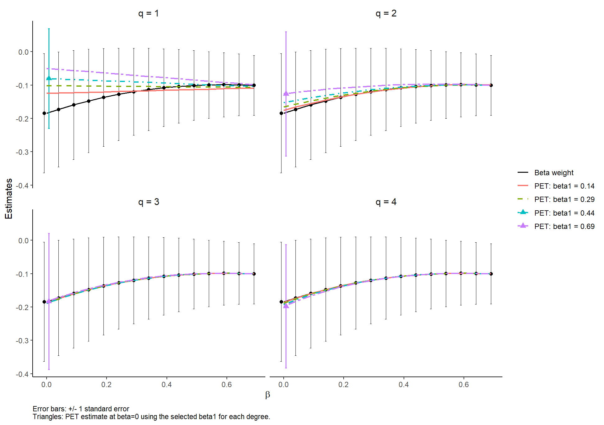

# PET

**Polynomial approximation and extrapolation to the target estimand**

Development version 0.0.2. Implements PET and AIPW-PET for binary treatment with
continuous or binary outcomes, following [Orihara, Komukai and Li (2026), version 2](https://arxiv.org/abs/2608.09329v2).

## Features

- PET and AIPW-PET, targeting the average treatment effect (ATE).
- Continuous outcomes and binary outcomes on the risk difference scale.
- PSweight-style formula and external prediction inputs; either nuisance model can be external.
- Internal GLM models; GBM, SuperLearner, and other learners through external predictions only.
- Separate two parameter `BetaWeight()` estimation, with individual weights and effective sample sizes.
- Factor variables, reference categories, interactions, and explicit dummy columns.
- Hyperparameter selection, with individually configurable settings.
- Original PET estimated propensity variance; documented fixed-prediction and augmented-influence paths.
- S3 `print`, `summary`, `coef`, `vcov`, `confint`, and `plot` methods.

## Installation

From the supplied local source archive (R 4.1 or newer):

```r
install.packages("PET_0.0.2.tar.gz", repos = NULL, type = "source")
```

No compiler is required for PET itself. The optional plotting package:

```r
install.packages("ggplot2")
library(PET)
```

To install from the GitHub repository:

```r
install.packages("remotes")  # Run once if remotes is not installed.
remotes::install_github("SOrihara/PET_method")
```

The repository is private during coauthor review. Repository access is required
to install it at this stage.

## Quick start: continuous outcome

```r
set.seed(20260914)
n <- 600
dat <- data.frame(
  age = rnorm(n, 55, 10),
  sex = factor(sample(c("F", "M"), n, TRUE))
)
dat$A <- rbinom(n, 1, plogis(-0.7 + 0.035 * (dat$age - 55)))
dat$Y <- 2 + 0.75 * dat$A + 0.04 * (dat$age - 55) + rnorm(n)

fit <- PET(A ~ age + sex, yname = "Y", data = dat)
summary(fit)
coef(fit)
confint(fit)
fit$tuning$candidates
```

`trtgrp` controls which level is treated. By default the last alphabetical level is
treated. The estimate is always that group minus the other group; the target stays ATE.

## AIPW-PET and binary outcomes

```r
dat$event <- rbinom(n, 1,
  plogis(-1 + 0.45 * dat$A + 0.025 * (dat$age - 55)))

aug <- PET(
  ps.formula = A ~ age + sex,
  yname = "event", data = dat,
  augmentation = TRUE,
  out.formula = event ~ age + sex,
  family = "binomial"
)
summary(aug)
```

The outcome formula contains covariates only: separate regressions are fitted in
the two treatment groups. For binary outcomes supply 0/1 responses and
`family="binomial"`; the effect is a **risk difference**, not an odds ratio.
For continuous AIPW-PET use `out.formula=Y ~ age + sex` and `family="gaussian"`.

## External predictions and mixed inputs

```r
# Use predictions from any prior learner, in exactly the same row order as dat.
e_hat <- aug$propensity
m_hat <- aug$outcome.predictions  # columns "0" and "1"

external <- PET(
  ps.estimate = e_hat, out.estimate = m_hat,
  zname = "A", yname = "event", data = dat,
  augmentation = TRUE, family = "binomial"
)

# Internal PS plus externally predicted potential outcomes.
mixed <- PET(
  A ~ age + sex, out.estimate = m_hat,
  yname = "event", data = dat,
  augmentation = TRUE, family = "binomial"
)
```

`ps.estimate` accepts a vector for the treated level or a two-column matrix named
by treatment levels. `out.estimate` needs **both potential-outcome predictions for
every observation**, not just the prediction for the treatment actually received.
Named matrix columns are aligned by treatment label; unknown labels fail.
If both a formula and corresponding predictions are supplied, predictions take precedence.

External predictions do not carry the original model's estimation equations.
PET therefore uses an explicitly labeled fixed-PS variance for this path.
AIPW-PET uses the paper's plug-in augmented influence function. Neither path is a
general correction for arbitrary nuisance-learning uncertainty. Cross-fitting and
bootstrap are not run automatically.

## Internal learning methods

Internal fitting uses **GLM only**: logistic regression for the propensity score,
and separate Gaussian or binomial outcome regressions for AIPW-PET.

```r
glm_fit <- PET(
  A ~ age + sex, yname = "Y", data = dat,
  augmentation = TRUE, out.formula = Y ~ age + sex,
  ps.control = list(maxit = 100), out.control = list(maxit = 100)
)
```

Controls are `epsilon`, `maxit`, and `trace`. The `ps.method` and `out.method`
arguments accept only `"glm"`. GBM and SuperLearner are no longer called internally
and are not package dependencies. Fit them outside PET and pass their response-scale
predictions through `ps.estimate` and/or `out.estimate`, as shown above. Binary
predictions must be probabilities, and outcome predictions need both treatment arms.
Mixed internal-GLM/external-prediction inputs remain supported. External predictions
are not refitted, and the fixed-PS variance caveat still applies to unaugmented PET.

## Beta weight family

The basic call uses the same named inputs as `PSweight::PSweight()`:

```r
bw_simple <- BetaWeight(
  ps.formula = A ~ age + sex,
  yname = "Y", data = dat,
  beta1 = 2, beta2 = 2
)
summary(bw_simple)
```

Keep `ps.formula` / `ps.estimate`, `trtgrp`, `zname`, `yname`, `data`, `family`,
and `ps.control` as named arguments. The weighting family is always beta, so
there is no `weight` selector: choose its two shapes with `beta1` and `beta2`.
No manually prepared model matrix or estimating function is required.
This is a PSweight-style interface for binary-treatment weighting, not a full
replacement for PSweight. Outcome augmentation remains available through `PET()`;
`BetaWeight()` in this version implements unaugmented weighting only.

`BetaWeight()` estimates a weighted treatment contrast without PET extrapolation.
The two parameters follow the beta-family shape convention of
[Matsouaka and Zhou (2024)](https://doi.org/10.1002/bimj.202300156):

**h(e) = e^(beta1 - 1) (1 - e)^(beta2 - 1).**

The observed-arm weights are h(e)/e for treated observations and h(e)/(1-e) for
controls. Each arm's outcome mean is normalized by its own sum of weights.
The paper's optional common scaling constant is omitted because it cancels.

| (`beta1`, `beta2`) | Target estimand |
|---|---|
| (1, 1) | ATE / ordinary IPW |
| (2, 1) | ATT |
| (1, 2) | ATC |
| (2, 2) (default) | ATO / overlap weighting |
| Other positive shapes | WATE defined by h(e) |

```r
bw <- BetaWeight(A ~ age + sex, yname = "Y", data = dat,
                 beta1 = 2, beta2 = 2)
summary(bw)
confint(bw)
head(bw$weights)
bw$effective.sample.size

asymmetric <- BetaWeight(A ~ age + sex, yname = "Y", data = dat,
                         beta1 = 1.5, beta2 = 2.5)

# PET trajectory exponent 0.44 corresponds to shapes 1.44, 1.44.
symmetric <- BetaWeight(A ~ age + sex, yname = "Y", data = dat,
                        beta1 = 1.44, beta2 = 1.44)

# Previously computed PS predictions can come from any external learner.
bw_external <- BetaWeight(ps.estimate = e_hat, zname = "A", yname = "event",
                          data = dat, family = "binomial", beta1 = 2, beta2 = 2)
```

`beta1` and `beta2` are strictly positive shape parameters, not PET's beta fitting
endpoints. Shapes below 1 can emphasize extreme propensity scores. No automatic
shape selection is performed. For a PET trajectory exponent b, use shapes b+1, b+1.
Swapping treatment labels while preserving the target requires swapping the shapes.
Binary effects are risk differences. The returned `tilting` is h(e), `weights` are
the raw observed-arm weights, and `normalized.weights` sum to 1 within each arm;
these vectors follow `row.index` after any omissions.

Internal logistic GLM uses a two-shape generalization of the supplied demo's
empirical-score variance correction. Equal shapes reproduce its `beta.w()` results.
This finite-sample variance convention is documented in `?BetaWeight`; it is not
claimed to equal every other sandwich implementation. External PS predictions are
treated as fixed, with a warning. The intended nonconstant tilted target requires a
correctly specified PS model. This function implements unaugmented weighting;
it does not fit outcome models, extrapolate to ATE, or run bootstrap.

## Factors and explicit dummy variables

```r
dat$sex <- relevel(dat$sex, ref = "F")
factor_fit <- PET(A ~ age + sex, yname = "Y", data = dat,
                  beta.min = 0.44, degree = 2)

dat$male <- as.integer(dat$sex == "M")
dummy_fit <- PET(A ~ age + male, yname = "Y", data = dat,
                 beta.min = 0.44, degree = 2)
```

The design matrices are prepared outside the PET core. `contrasts` can specify
factor coding. Globally redundant columns are removed; an unidentified model
within an outcome-treatment arm is rejected. Missing inputs fail by default;
`na.action="omit"` applies one common row mask and records `row.index`/`omitted`.
Prepare external predictions in the original data order before using that option.

## Hyperparameter defaults and overrides

| Parameter | Version 2 default | Override |
|---|---|---|
| Number of fitting points | K = 50 | `K` |
| Upper beta | 0.99 | `beta.max` |
| Lower beta | Select from 0.44, 0.49, ..., 0.69 | `beta.min` or `beta.candidates` |
| Degree | Select from 1, 2, 3, 4 | `degree` or `degree.candidates` |
| Variance target kappa | PET: 5/6; AIPW-PET: 1 | `kappa` |

```r
# Both fixed: no hyperparameter search.
manual <- PET(A ~ age + sex, yname = "Y", data = dat,
              K = 50, beta.min = 0.29, beta.max = 0.99, degree = 2)

# Fixed degree, automatic lower beta from a custom candidate set.
custom <- PET(A ~ age + sex, yname = "Y", data = dat,
              degree = 2, beta.candidates = c(0.14, 0.29, 0.44, 0.69))
```

Algorithm 1 chooses the smallest qualifying lower beta for each degree and then
the largest qualifying degree. If the variance target is unattainable, its original
fallback rules apply and the result reports `target.met=FALSE`; meeting the target
is not guaranteed. Confidence intervals do not include tuning-selection uncertainty.

## Trajectory plots

```r
p <- plot(fit)  # +/- 1 SE, as in the supplied demo
print(p)
ggplot2::ggsave("trajectory.png", p, width = 10.8, height = 7.6, dpi = 180)

# Explicitly request 95% normal confidence intervals instead.
plot(fit, error = "ci", conf.level = 0.95)

# Obtain tables for custom plots or export.
tr <- trajectory(fit, degree = 1:4,
                  beta.min = c(0.14, 0.29, 0.44, 0.69))
tr$selected
head(tr$curves)
```

Black points are the beta-weight estimates, colored lines are fitted PET curves,
and triangles at beta=0 show the estimate selected for each degree. The display
range ending at 0.69 is distinct from the fitting range ending at 0.99.
This is a sensitivity diagnostic, not a test that the extrapolation assumption holds.

## Real data example: FEV dataset

The analysis in v2 is reproducible using the public `doBy::fev` dataset:

```r
data("fev", package = "doBy")
fev_dat <- subset(fev, Age >= 9)
fev_dat$A <- as.integer(fev_dat$Smoke == "Yes")
fev_dat$male <- as.integer(fev_dat$Gender == "Boy")
fev_fit <- PET(A ~ Age + Ht + male, yname = "FEV", data = fev_dat)
summary(fev_fit)
plot(fev_fit)
```

On the validated Windows/R 4.3.1 runtime, with 439 observations, the selected result is q=1, beta.min=0.44, ATE=-0.08034,
SE=0.14954, and 95% CI [-0.37343, 0.21275]. Per-degree selected lower betas are
0.44, 0.69, 0.69, 0.69. The patient-level dataset is not bundled here.



## Documentation

- [HTML guide (English)](docs/index.html)
- R help: `?PET`, `?BetaWeight`, `?trajectory`, `?plot.PET`, `citation("PET")`
- Runnable scripts: `inst/examples/getting-started.R`, `inst/examples/fev-application.R`


## Citation

Orihara, S., Komukai, S., and Li, F. (2026). *Estimating the average treatment effect
under limited overlap via Polynomial Approximation and Extrapolation*.
[arXiv:2608.09329v2](https://arxiv.org/abs/2608.09329v2).

Matsouaka, R. A., and Zhou, Y. (2024). *Causal inference in the absence of positivity:
The role of overlap weights*.
[Biometrical Journal, 66(4), 2300156](https://onlinelibrary.wiley.com/doi/10.1002/bimj.202300156).

PSweight is used as an interface reference and
validation comparator, not a runtime dependency of the PET core.

